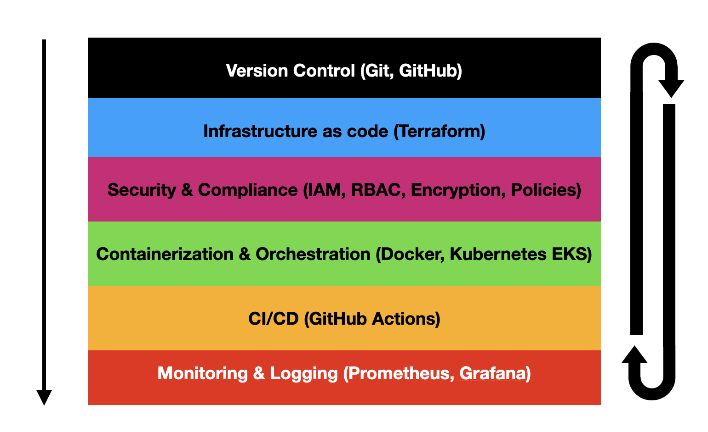
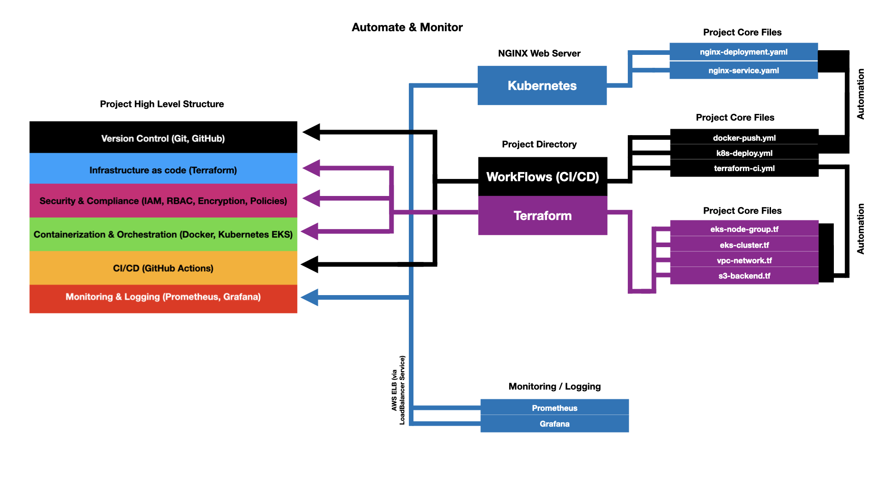
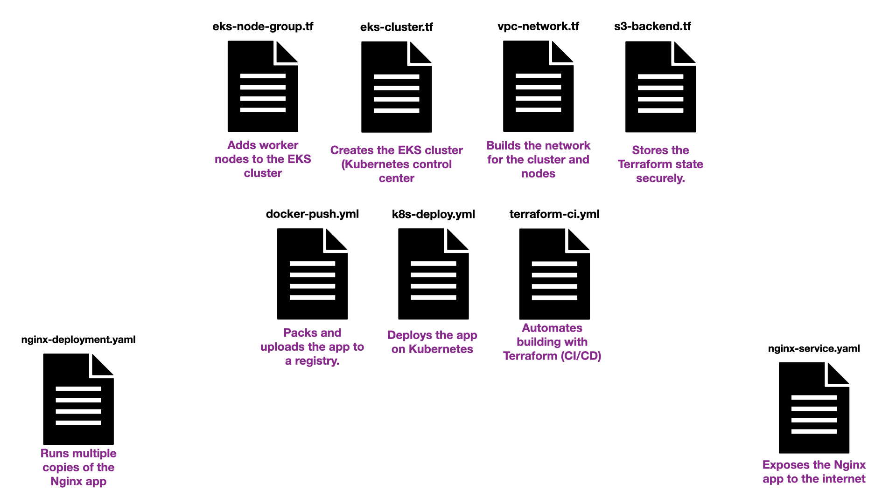
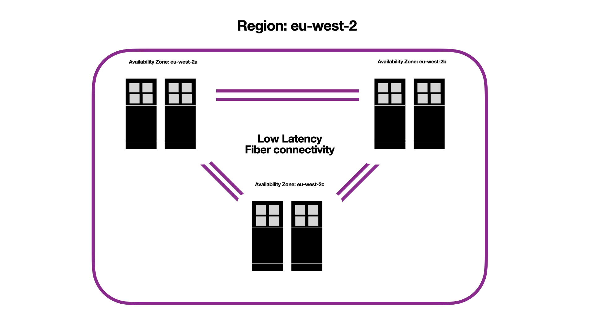
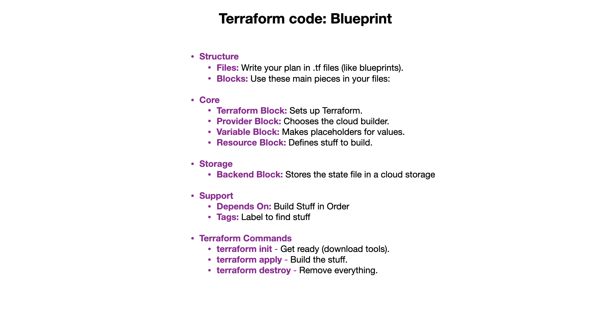
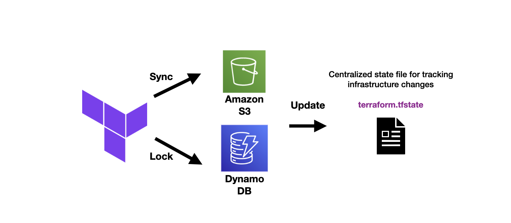
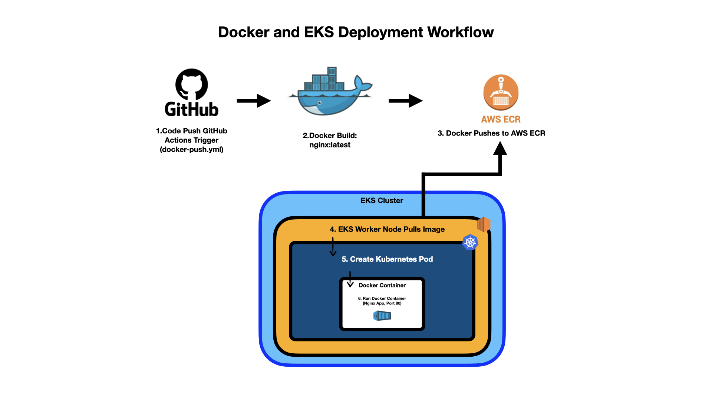

# AWS DevOps CI/CD Pipeline

## Overview

This project demonstrates a CI/CD pipeline for AWS deployments. Below is a custom-made, redesigned diagram of the DevOps workflow, specifically tailored for this project:

  
_Caption: Illustrates the flow from code commits to deployment on AWS EC2 instances._

## Key Components

- **Version Control**: Git, GitHub
- **Infrastructure as Code**: Terraform
- **Security & Compliance**: IAM, RBAC, Encryption, Policies
- **Containerization & Orchestration**: Docker, Kubernetes EKS
- **CI/CD**: GitHub Actions
- **Monitoring & Logging**: Prometheus, Grafana

## Update 2.0: Enhanced DevOps Project Architecture and File Structure

### Project Architecture Overview

  
_Caption: High-level flow of the AWS DevOps CI/CD project, from design to individual files._

### File Structure Breakdown

  
_Caption: Visual representation of what each file does in the project._

### Regional Architecture

  
_Caption: Shows the eu-west-2 region with Availability Zones (eu-west-2a, eu-west-2b, eu-west-2c) and low-latency fiber connectivity._

- **Key Features:**
  - **Region:** `eu-west-2` (London), a geographic area in AWS.
  - **Availability Zones:** `eu-west-2a`, `eu-west-2b`, `eu-west-2c`—isolated locations within the region for high availability.
  - **Connectivity:** Low-latency fiber links between zones, ensuring fast and reliable communication.
- **Purpose:** Explains how AWS organizes infrastructure across multiple Availability Zones, promoting fault tolerance and scalability for resilient cloud architectures like EKS or VPCs.

### What’s New in This Update

- Updated the architecture diagram (`NewDiagram.png`) to reflect the latest project structure, showing the flow from high-level design to specific Terraform and Kubernetes files.
- Added a new file structure diagram (`files.png`) to illustrate the purpose of each file (e.g., `eks-cluster.tf`, `nginx-deployment.yml`).
- Included a regional architecture diagram (`Az.png`) to highlight the `eu-west-2` region’s multi-AZ setup.
- Helps viewers quickly understand how network, cluster, monitoring, and regional components connect.

### Purpose of These Diagrams

These diagrams provide a clear, step-by-step guide to setting up the AWS DevOps CI/CD project:

- **Architecture Diagram:** Maps the high-level design to detailed file configurations, highlighting key components like VPC, EKS cluster, node groups, and IAM roles.
- **File Structure Diagram:** Breaks down the role of each file, making it easy to see how the project is organized and what each file does.
- **Regional Architecture Diagram:** Visualizes the `eu-west-2` region’s Availability Zones, aiding in multi-AZ deployment planning.

## Terraform Fundamentals

### Structure

  
_Caption: Visual representation of Terraform code structure and file purposes._

- **Files:** Write your infrastructure plan in `.tf` files (like blueprints).
- **Blocks:** Use these main building blocks in your files:

### Core

- **Terraform Block:** Configures Terraform’s settings (e.g., version).
  - Example: `required_version = "1.5.0"` (ensures a compatible version).
- **Provider Block:** Selects the cloud platform to build on.
  - Example: `provider "aws" { region = "us-east-1" }` (chooses AWS and a region).
- **Variable Block:** Defines placeholders for adjustable values.
  - Example: `variable "region" { default = "us-east-1" }` (allows easy updates).
- **Resource Block:** Specifies the cloud resources to create (e.g., networks, servers).
  - Example: `resource "aws_vpc" "my_vpc" { cidr_block = "10.0.0.0/16" }` (creates a network).

### Storage

  
_Caption: Illustrates how Terraform stores and updates the state file using S3 and DynamoDB for synchronization and locking._

- **Backend Block:** Stores the state file in a persistent location (e.g., cloud storage).
  - Example: `backend "s3" { bucket = "my-bucket" }` (saves state in S3).

### Support

- **Depends On:** Ensures resources are built in the correct order.
  - Example: `depends_on = [aws_vpc.my_vpc]` (waits for the network).
- **Tags:** Labels resources for easy identification in the cloud.
  - Example: `tags = { Name = "my-vpc" }` (names the network).

### Terraform Commands

- **`terraform init`:** Prepares Terraform by downloading tools and setting up.
- **`terraform apply`:** Executes the plan to create or update resources.
- **`terraform destroy`:** Removes all resources created by the plan.

### Docker and EKS Deployment Workflow

  
_Caption: Illustrates the CI/CD workflow: GitHub Actions builds and pushes a Docker image to AWS ECR, which an EKS Worker Node pulls to run in a Kubernetes Pod managed by EKS._

- **Steps:**
  1. **Code Push:** Push to `main` branch triggers GitHub Actions (`docker-push.yml`).
  2. **Docker Build:** Builds the image (`nginx:latest`).
  3. **Push to AWS ECR:** Pushes image to `207567758913.dkr.ecr.eu-west-2.amazonaws.com`.
  4. **EKS Worker Node Pulls Image:** Node retrieves the image from ECR.
  5. **Kubernetes Creates Pod:** EKS orchestrates the Pod deployment.
  6. **Run Container:** Docker container runs the Nginx app on port 80.

## Cost Optimization Strategy

### Overview

To maintain low costs while ensuring the necessary resources for the EKS Pods in this AWS DevOps CI/CD project, a cost optimization strategy was implemented. The transition from `t3.micro` to `t3.small` EKS Worker Node instances was made to support the project’s requirements, given the constraints of the AWS Free Tier.

### Decision and Rationale

- **Initial Setup:** The project began with `t3.micro` instances (2 vCPUs, 1 GiB memory), which are within the AWS Free Tier (750 hours/month). However, this limited capacity was insufficient for running multiple Pods (e.g., `nginx-deployment.yml` with `replicas: 2`).
- **Upgrade to `t3.small`:** Upgrading to `t3.small` (2 vCPUs, 2 GiB memory) provided adequate resources (20% baseline performance, 24 CPU credits/hr) while incurring a minimal cost outside the Free Tier boundary.
- **Cost Impact:** This upgrade resulted in a small hourly cost (`$0.012` on-demand, `$0.008` 3-year reserved), balanced against operational efficiency.

### Cost Optimization Measures

- **Budget Alerts:** AWS Budgets were set up to monitor spending and receive email notifications when thresholds are exceeded.

  - Example Budgets:

    | Name                      | Threshold | Budget | Amount Used |
    | ------------------------- | --------- | ------ | ----------- |
    | My Monthly Cost Budget    | OK        | $10.00 | $0.75       |
    | My Monthly Cost Budget 15 | OK        | $15.00 | $0.75       |
    | My Monthly Cost Budget 20 | OK        | $20.00 | $0.75       |

- **Resource Efficiency:** Pod resource `requests` and `limits` were considered to optimize usage on the `t3.small` instance (e.g., `cpu: "100m"`, `memory: "100Mi"` per Pod).

### Purpose

This strategy ensures cost-effective operation within a small budget while supporting the EKS cluster’s scalability and reliability, aligning with the project’s goal of a resilient CI/CD pipeline.

### Integration with Project

The `t3.small` instances, defined in `eks-node-group.tf`, support the deployment of Pods (e.g., Nginx) as outlined in `nginx-deployment.yml`, while budget alerts help manage costs as the project scales.

## Additional Kubernetes Example: KubernetesProject

As an additional example of Kubernetes and EKS deployment, the `KubernetesProject` repository showcases a simple Nginx web server hosted on an EKS cluster in `eu-west-2`. This project demonstrates manual deployment of a Kubernetes cluster, including pod and service configuration, and exposes the web server via a LoadBalancer. The full project, including its architecture blueprint, can be found in the separate repository: [SysCd/kubernetesProject](https://github.com/SysCd/kubernetesProject).

- **Architecture Blueprint:**
    
  _Caption: Illustrates the Kubernetes cluster setup on EKS, with an Nginx pod exposed via a LoadBalancer._

- **Key Features:**

  - **Cluster Setup:** EKS cluster in `eu-west-2` with `t3.small` nodes in the `WorkNodes` node group.
  - **Pod and Service:** `web-pod` runs an Nginx container, exposed via a `LoadBalancer` service.
  - **Storage:** Image sourced from AWS ECR (`207567758913.dkr.ecr.eu-west-2.amazonaws.com/kubernetesproject-web:latest`).
  - **Networking:** ELB exposes the pod to the internet (`http://a73dee6fcb2e447f5bc8696917ebcfd0-534779837.eu-west-2.elb.amazonaws.com`).
  - **Configuration:** Defined in `Web-Pod.yaml` and `Web-Service.yaml`.

- **Purpose:** This project complements the CI/CD pipeline by showing a manual EKS deployment, focusing on Kubernetes fundamentals and pod exposure, with a detailed blueprint diagram.
